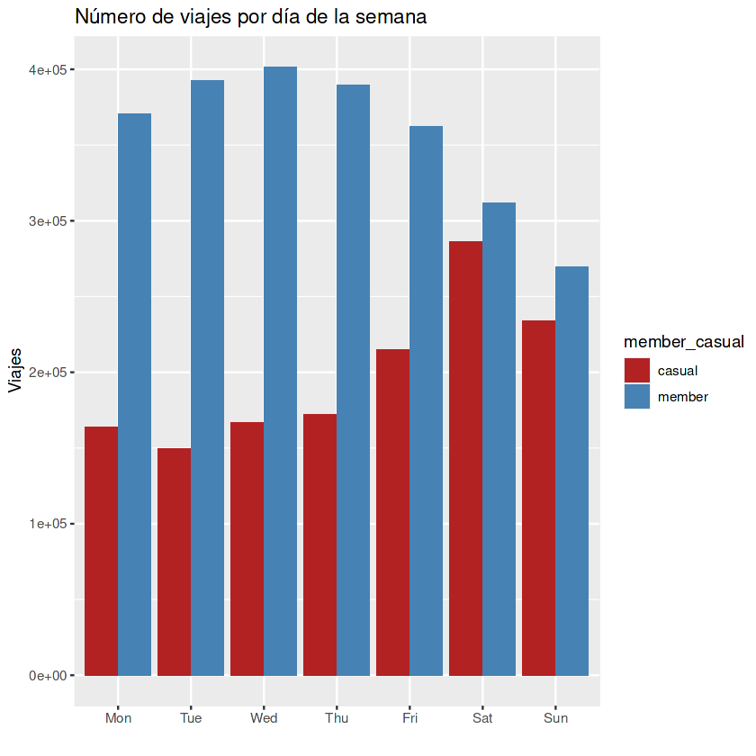

# 🚴‍♀️ Cyclistic Case Study — Google Data Analytics Capstone

**Autor:** Valeria Medina  
**Herramientas:** R / RStudio / tidyverse / ggplot2  
**Fuente de datos:** [Divvy/Cyclistic bike-share dataset](https://divvy-tripdata.s3.amazonaws.com/index.html)  
**Plataforma original:** [Kaggle Notebook](https://www.kaggle.com/code/valmegu/proyecto-cyclistic)

---

## Descripción
Este proyecto forma parte del *Google Data Analytics Capstone Case Study*.  
Cyclistic es una empresa ficticia de bicicletas compartidas con sede en Chicago que busca aumentar la cantidad de **miembros anuales**, ya que generan mayores ingresos que los usuarios casuales.  
El objetivo de este análisis es **entender cómo difieren los patrones de uso entre ambos grupos** y proponer estrategias basadas en datos para aumentar la conversión de usuarios casuales en suscriptores.

---

## Pregunta clave

> **¿Cómo usan las bicicletas los miembros anuales y los usuarios casuales de manera diferente?**

---

## Resumen del análisis

🔹 12 meses de datos (junio 2024 – junio 2025)  
🔹 5.6 millones de registros originales  
🔹 3.8 millones de registros tras limpieza  
🔹 Lenguaje: R (tidyverse, dplyr, ggplot2)

---

## Proceso de análisis

1. **Preparación de datos:**  
   - Importación de 12 archivos .csv mensuales de uso de bicicletas (junio 2024 – junio 2025).  
   - Unión de datasets y validación de columnas.  
   - Eliminación de registros duplicados y valores nulos.  

2. **Limpieza:**  
   - Cálculo de duración del viaje (`ride_length`) y día de la semana (`weekday`).  
   - Filtrado de viajes menores a 1 minuto o con duración negativa.  
   - Estandarización de tipos de bicicletas y usuarios.  

3. **Análisis:**  
   - Distribución de viajes por tipo de usuario y día.  
   - Duración promedio por tipo de bicicleta.  
   - Frecuencia horaria (patrones de commuting).  
   - Comparación estacional.  

4. **Visualización:**  
   Se usaron gráficos de barras y líneas para visualizar patrones temporales y diferencias entre tipos de usuario.

### Ejemplo visual — Uso semanal: miembros vs. casuales

  

---

## Resultados destacados
- Los **miembros anuales** tienden a usar las bicicletas en días laborales, con trayectos cortos y recurrentes.  
- Los **usuarios casuales** prefieren fines de semana y trayectos más largos.  
- Potenciales estrategias de conversión incluyen descuentos anuales o promociones de verano.

---

## Recomendaciones de negocio

1. **Promociones de fin de semana:**  
   Ofrecer descuentos en membresías para quienes más usan el servicio sábados y domingos.

2. **Incentivos al commuting:**  
   Crear planes de fidelización enfocados en trayectos cortos y regulares (usuarios que viajan a diario).

3. **Segmentación por temporada:**  
   Promocionar la membresía anual con beneficios específicos según época del año (mayor uso en verano).

4. **Comunicación dirigida:**  
   Resaltar en la app y redes sociales los beneficios económicos y de conveniencia de ser miembro anual.

---

## Conclusiones finales
El análisis demuestra cómo el estudio de los patrones de uso puede guiar decisiones de negocio basadas en datos.  
Los resultados revelan oportunidades claras para aumentar la conversión de usuarios casuales en miembros anuales mediante estrategias de marketing estacional y promociones orientadas al comportamiento real de uso.

---

## Enlaces
- [Notebook en Kaggle](https://www.kaggle.com/code/valmegu/proyecto-cyclistic)
- [Perfil de LinkedIn](https://www.linkedin.com/in/valeriamedinaguzman/)
- [Repositorio GitHub](https://github.com/Valmegu/Cyclistic-CaseStudy)

